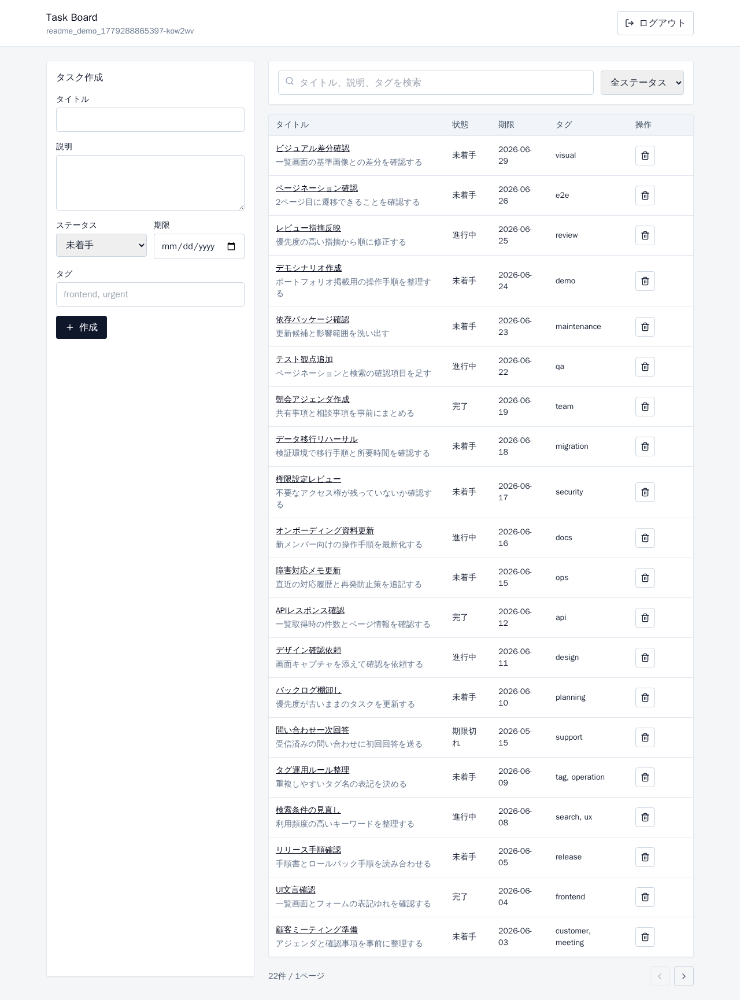

# TaskBoard

タスク管理を行うためのWebアプリケーションです。

React + Ruby on Rails API 構成で作成しており、
認証・タスクCRUD・検索・ページネーション・タグ管理のAPI実装を行っています。

## URL

Demo: 未公開

---

## Render / Supabase 向け設定

本番公開時は、以下を前提にしています。

* Backend(Render Service): `DATABASE_URL`, `SECRET_KEY_BASE`, `CORS_ALLOWED_ORIGINS`
* Frontend(Render Static): `VITE_API_BASE_URL`
* DB(Supabase): Supabase の PostgreSQL 接続文字列を `DATABASE_URL` に設定

`CORS_ALLOWED_ORIGINS` は許可するフロントエンドのオリジンをカンマ区切りで指定します。
`VITE_API_BASE_URL` は Backend の公開URLをそのまま指定します。`/api` は自動で付与されるため、末尾に `/api` は付けません。
Backend のヘルスチェックは `/up` を使えます。

---

## 使用技術

### Frontend

* React
* TypeScript
* Vite
* Tailwind CSS

### Backend

* Ruby on Rails API
* PostgreSQL
* Session Authentication

### Infrastructure

* Docker Compose
* Render
* Supabase

---

## 主な機能

* ユーザー登録
* ログイン / ログアウト
* タスク一覧表示
* タスク作成
* タスク編集
* タスク削除
* ステータス管理
* タグ管理
* 検索機能
* ページネーション
* API連携

---

## 画面イメージ

---

## API構成

| Method | Endpoint              | Description |
| ------ | --------------------- | ----------- |
| POST   | /api/v1/auth/register | ユーザー登録      |
| POST   | /api/v1/auth/login    | ログイン        |
| DELETE | /api/v1/auth/logout   | ログアウト       |
| GET    | /api/v1/auth/me       | ログインユーザー取得  |
| GET    | /api/v1/tasks         | タスク一覧取得     |
| GET    | /api/v1/tasks/:id     | タスク詳細取得     |
| POST   | /api/v1/tasks         | タスク作成       |
| PATCH  | /api/v1/tasks/:id     | タスク更新       |
| DELETE | /api/v1/tasks/:id     | タスク削除       |
| GET    | /api/v1/tags          | タグ一覧取得      |
| POST   | /api/v1/tags          | タグ作成        |
| DELETE | /api/v1/tags/:id      | タグ削除        |

---

## 工夫したポイント

* React + Rails API の分離構成
* セッションを利用した認証
* RESTfulなAPI設計
* タスク検索とページネーションに対応
* タグを利用したタスク分類
* Docker Compose による開発環境構成

---

## 今後追加予定

* デモ環境の公開

---

## 開発背景

Rails API と React を組み合わせたタスク管理アプリとして、
実務で利用されやすい認証・CRUD・検索・管理画面構成を意識して作成しました。

---
